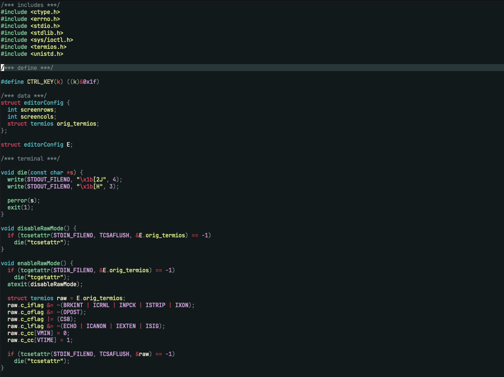

# Yami_Q_ray Color Scheme for Vim

This is a Vim dark color scheme inspired by Yami_Q_ray.

## Screenshot


## Installation
For vim-plug
```
Plug 'devoc09/yami_q_ray'
```

## Todo
- [] support 256-colors

## Thanks
I love [Macross series](https://en.wikipedia.org/wiki/Macross)✈️ 
